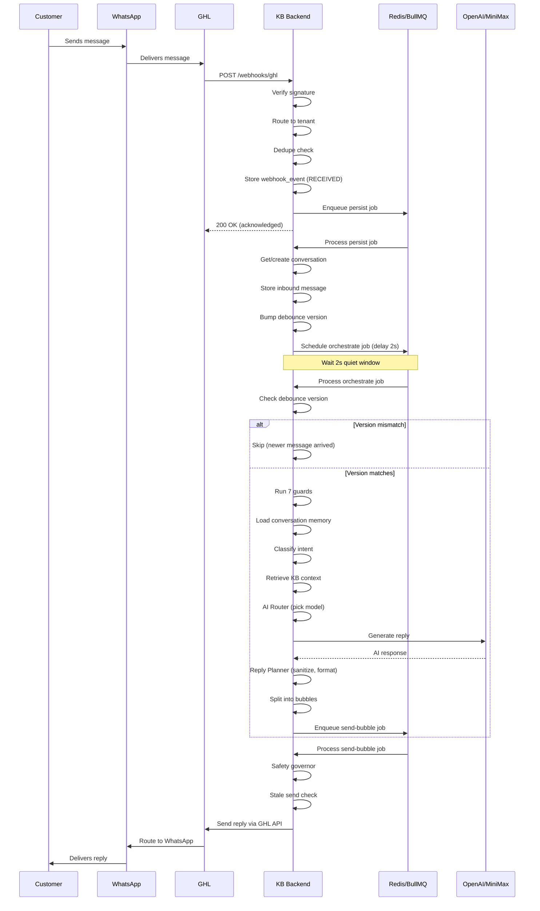

# KB × GHL Architecture Document

## Founder-Friendly Guide to How the AI Sales Bot Works

---

## PART 1 — High-Level Architecture

```
┌──────────┐    ┌──────────┐    ┌──────────┐    ┌──────────────┐
│ Customer │───▶│ WhatsApp │───▶│    GHL    │───▶│  KB Backend  │
│          │◀───│          │◀───│ (GoHigh   │◀───│  (NestJS)    │
│          │    │          │    │  Level)   │    │              │
└──────────┘    └──────────┘    └──────────┘    └──────┬───────┘
                                                       │
                                              ┌────────▼───────┐
                                              │   Redis/       │
                                              │   BullMQ       │
                                              │   (Queues)     │
                                              └──────┬───────┘
                                                     │
                                              ┌──────▼───────┐
                                              │   OpenAI /    │
                                              │   MiniMax     │
                                              │   (AI Models) │
                                              └──────────────┘
```

**The flow:**
1. Customer sends message on WhatsApp
2. WhatsApp delivers to GHL (GoHighLevel CRM)
3. GHL sends a **webhook** (HTTP POST) to KB's backend
4. KB processes the message through queues, loads conversation history, retrieves knowledge base
5. KB calls OpenAI/MiniMax to generate a reply
6. Reply goes through quality checks, formatting, then back to GHL
7. GHL delivers to WhatsApp
8. Customer sees the reply

---

## PART 2 — Inbound Pipeline (Message Received)

### Step 1: Webhook Reception

| Field | Value |
|-------|-------|
| Module | `webhooks` |
| File | `apps/backend/src/modules/webhooks/webhooks.controller.ts` |
| Endpoint | `POST /webhooks/ghl` |
| Function | `handleGhlWebhook()` |

**Input**: GHL sends a JSON payload containing:
```json
{
  "locationId": "oI3MIP3nZkj4rSKEwJDo",
  "event": "InboundMessage",
  "data": {
    "id": "pE1aF3oR73DknM1f1mSo",
    "conversationId": "FOdPCJQfeaKnUUcSz76e",
    "contactId": "h4G5p2YNhgxZQPAJ8dQt",
    "message": "Hello, I need help",
    "messageType": "text"
  },
  "timestamp": "2026-07-01T05:07:00Z"
}
```

**Can it fail?** Yes — if `locationId` or `event` are missing, throws `BadRequestException` (400).

### Step 2: Webhook Signature Verification

| File | `apps/backend/src/modules/webhooks/webhook-verification.service.ts` |
|------|----------------------------------------------------------------------|

**What happens**: Checks `x-signature` header against HMAC-SHA256 of body using `WEBHOOK_SIGNATURE_SECRET`. In non-production, accepts unsigned webhooks.

**Can it fail?** Yes — if signature is invalid in production, returns 401. Currently a placeholder that always returns `valid: true`.

### Step 3: Tenant Routing

| File | `apps/backend/src/modules/webhooks/ghl-inbound-webhook-tenant-resolution.ts` |
|------|-------------------------------------------------------------------------------|
| Function | `resolveInboundGhlWebhookTenant()` |

**What happens**: Takes GHL `locationId` and finds which tenant (customer workspace) owns that GHL location. Searches both `tenant_ghl_connections` and `tenants.ghl_location_id`.

**Can it fail?** Yes — if no tenant is found for the locationId, returns `{ ok: false, reason: 'no_connected_tenant' }`. Message is stored with status `SKIPPED`.

### Step 4: Deduplication (Webhook Level)

| File | `apps/backend/src/modules/webhooks/ghl-webhook-dedupe.ts` |
|------|------------------------------------------------------------|
| File | `apps/backend/src/modules/webhooks/webhooks.service.ts:139-155` |
| Function | `extractGhlInboundDedupeKeys()` → `findExistingEvent()` |

**Two-tier dedupe:**
- **Tier 1**: Uses GHL's `data.id` (the message ID). If GHL sends the same message twice with the same ID → caught.
- **Tier 2**: If `data.id` is missing, hashes the entire payload. Different payloads (different timestamps or fields) → **NOT caught**.

**Can it fail?** Yes — if GHL sends the same message through two different webhook shapes (one with `data.id`, one without), both pass through undeduped. This is a **known risk**.

### Step 5: Webhook Event Storage

| File | `apps/backend/src/modules/webhooks/webhooks.service.ts:166-178` |

Stores a record in `webhook_events` table with status `RECEIVED`.

### Step 6: Enqueue for Processing

| File | `apps/backend/src/modules/webhooks/webhooks.service.ts:180-184` |
| Queue | `INBOUND_MESSAGE_PROCESSOR` |
| Job type | `persist` |

The webhook handler **returns immediately** (200 OK) after enqueueing. GHL is told "we got it" within milliseconds. Actual processing happens asynchronously.

### Step 7: Persist Job (Queue Worker)

| File | `apps/backend/src/queues/processors/inbound-message.processor.ts` |

The `persist` job:
1. **Resolves or creates the conversation** — finds the conversation by GHL conversation ID, or creates a new one using a derived key (`aisbp:conv:sms:{tenantId}:{contactId}`)
2. **Resolves the contact** — maps phone number to GHL internal contact ID
3. **Handles voice/audio** — if message is voice, sends to transcription queue
4. **Handles images** — if message has an image, stores image URL for vision models
5. **Stores the inbound message** in `messages` table
6. **Bumps the debounce version** in conversation metadata
7. **Schedules orchestrator job** with a delay (default 2 seconds)

**Can it fail?** Yes — 3 retries with exponential backoff. If all fail, webhook event marked `FAILED`.

### Step 8: Debounce (Quiet Window)

| File | `apps/backend/src/lib/inbound-debounce.ts` |
| Config | `AISBP_INBOUND_DEBOUNCE_MS` (default: 2000ms) |

**Why**: If a customer sends "Hello" then "I need help with pricing" 1 second later, KB waits 2 seconds after the LAST message before processing. This groups rapid messages together so the AI can answer both at once.

**How**: Each new message bumps `pendingVersion` in conversation metadata. The orchestrator job carries a `debounceVersion`. When the job fires, it checks: if `pendingVersion !== debounceVersion`, a newer message arrived → skip this job.

**Race risk**: If a duplicate webhook delivery bumps `pendingVersion`, the REAL message's orchestrator is killed, and the DUPLICATE's orchestrator runs instead. The duplicate may have incomplete data (missing GHL message ID).

### Step 9: Orchestrate Job (Queue Worker)

| File | `apps/backend/src/queues/processors/inbound-message.processor.ts:1179-1378` |
| Function | `executeOrchestrationPipeline()` |

1. **Chat reset check** — if message is `/new` or similar, resets conversation state
2. **Auto-tagging** — applies automatic GHL contact tags based on intent rules
3. **GHL context sync** (optional, feature-flagged) — pulls recent GHL conversation history before replying
4. **Loads tenant context** — bot mode, GHL location, settings
5. **Loads prompt config** — the active bot profile with system prompt, temperature, model
6. **Loads agency policy** — agency-level system policy
7. **Loads conversation** — current conversation record
8. **Calls orchestration** → `ConversationOrchestrationService.orchestrate()`

### Step 10: Orchestration (AI Pipeline)

| File | `apps/backend/src/modules/orchestration/orchestration.service.ts` |

**The orchestration runs a 12-step pipeline:**

```
1. GUARDS (7 checks, short-circuits on first fail)
   ├─ Bot enabled?
   ├─ GHL connected?
   ├─ Automation paused?
   ├─ Handover active?
   ├─ Quota available?
   ├─ Message type supported?
   └─ Channel supported?
   
2. CONVERSATION MEMORY — loads last 20 user turns, respects /new resets, 24h session gap

3. INTENT CLASSIFICATION — lexical matching (GREETING, MENU, BOOKING, COMPLAINT, etc.)
   File: apps/backend/src/modules/conversation-policy/conversation-intent.ts

4. COMPLAINT DETECTION → auto handover + escalation if complaint detected

5. HUMAN HANDOVER INTENT → escalation + acknowledgment reply

6. BOOKING FLOW → ConversationBookingFlowService handles booking-specific logic

7. KB RETRIEVAL — searches knowledge base with intent-aware filtering
   File: apps/backend/src/modules/kb/kb.service.ts

8. OPTION SELECTION — deterministic A/B/C picks from menu options

9. AI ROUTER — chooses model (gpt-4o-mini vs gpt-4o) based on complexity
   File: apps/backend/src/modules/ai-router/ai-router.service.ts

10. REPLY PLANNER — generates reply via LLM or deterministic fallback
    File: apps/backend/src/modules/reply-planning/reply-planner.service.ts

11. OPTION MEMORY CAPTURE — remembers what options were shown

12. ENQUEUE SEND BUBBLE — adds send job to SEND_BUBBLE queue
```

### Step 11: Generation (AI Model Call)

| File | `apps/backend/src/modules/generation/generation.service.ts` |

**Prompt stack (what the AI sees):**
```
1. System prompt (from tenant's bot profile)
2. Language mirror instruction (reply in customer's language)
3. Brand identity instruction ("You represent AI Sales Bot Pro...")
4. Conversation memory (last 20 messages, user ↔ assistant)
5. KB context (relevant knowledge base excerpts)
6. Conversation policy (intent, selection state, rules)
7. Customer's latest message
```

**Provider selection**: Checks `agencies.active_ai_provider` → uses MiniMax or OpenAI. Falls back to OpenAI if primary fails.

**Retry**: 3 retries with exponential backoff (500ms base, 30% jitter) for transient errors (429, 5xx, network).

**Sanitization**: Strips `<think>` blocks and citation/debug lines from AI output before sending to customer.

### Step 12: Reply Planning

| File | `apps/backend/src/modules/reply-planning/reply-planner.service.ts` |

**Strategy:**
- **Handover** → no reply, escalate to human
- **Policy forced reply** → deterministic (no LLM needed)
- **Option selection** → deterministic template (A/B/C picks)
- **Live generation** → calls GenerationService for LLM reply
- **Fallback** → if generation fails, uses KB snippet or generic message

**Post-generation guards:**
- Outbound policy guard
- Menu KB grounding
- Business hours grounding
- KB leak sanitization
- Safety governor
- Brand identity guard
- Singapore language check

---

## PART 3 — Outbound Pipeline (Sending Reply)

### Step 1: Send Bubble Job

| File | `apps/backend/src/queues/processors/send-bubble.processor.ts` |
| Queue | `SEND_BUBBLE` |

1. **Safety governor** — applies guardrails to outbound text
2. **Tenant send cap** — limits concurrent sends per tenant
3. **Per-conversation ordering lock** — ensures bubbles send in order
4. **Stale send check** — if a newer inbound arrived during generation, **cancels** the send and re-queues orchestration
5. **Prior-bubble gate** — waits for previous bubble to complete before sending next
6. **Outbound send** → calls `OutboundSendService.sendReply()`

### Step 2: GHL API Call

| File | `apps/backend/src/modules/outbound/outbound-send.service.ts` |

1. Loads GHL API credentials
2. Sends each bubble sequentially via GHL API
3. Records each send in `outbound_sends` ledger (idempotency)
4. Debits quota (1 credit per logical reply or per bubble)
5. Reports success/failure per bubble

### Step 3: GHL → WhatsApp

GHL receives KB's API call and routes the message to the customer via WhatsApp. KB does not control this step.

### Step 4: Follow-up

| File | `apps/backend/src/modules/follow-up-engine/follow-up-engine.service.ts` |
| Queue | `FOLLOW_UP` |

After a successful send, follow-up jobs are scheduled. If the customer doesn't reply within a configurable window, KB sends a follow-up message (either fixed text or AI-generated).

---

## PART 4 — Queue Architecture

| Queue | Purpose | Producer | Consumer | Delay | Retries | Retry Delay |
|-------|---------|----------|----------|-------|---------|-------------|
| `inbound-message-processor` | Process inbound messages | WebhooksService | InboundMessageProcessor | N/A (immediate) | 3 | 1s exp |
| `media-transcription` | Transcribe voice notes | InboundMessageProcessor | MediaTranscriptionProcessor | N/A | 2 | 3s exp |
| `send-bubble` | Send replies to GHL | InboundMessageProcessor | SendBubbleProcessor | N/A | 3 | 2s exp |
| `kb-ingest` | Ingest knowledge base docs | KbService | KbIngestProcessor | N/A | 3 | 5s exp |
| `handover-notify` | Notify on handover | OrchestrationService | HandoverNotifyProcessor | N/A | 2 | 1s fixed |
| `quota-threshold-alert` | Alert on low quota | QuotasService | QuotaThresholdAlertProcessor | N/A | 1 | — |
| `analytics-rollup` | Periodic analytics | Cron/Manual | AnalyticsRollupProcessor | N/A | 1 | — |
| `follow-up` | Follow-up automation | SendBubbleProcessor | FollowUpProcessor | Scheduled | 1 | — |

**Key dependency chain:**
```
Webhook → INBOUND_MESSAGE_PROCESSOR (persist) 
       → INBOUND_MESSAGE_PROCESSOR (orchestrate, delayed 2s)
       → SEND_BUBBLE (send reply)
       → FOLLOW_UP (schedule follow-up)
```

---

## PART 5 — Conversation State Machine

| State | Set By | Blocks What | Description |
|-------|--------|-------------|-------------|
| `ACTIVE` | Conversation creation | Nothing | Normal operation, bot replies |
| `HANDOVER` | `ConversationsService.pauseForHandover()` | AI replies (guard 4) | Human has taken over |
| `PAUSED` | GHL automation pause | AI replies (guard 3) | Conversation paused in GHL |
| `CLOSED` | Conversation resolution | Implicitly blocks (no new messages) | Conversation ended |
| `PENDING` | Initial state | Unknown | Transient state |

**Handover flow:**
```
Customer complains → intent = COMPLAINT 
  → safety governor detects complaint 
  → calls pauseForHandover(status=HANDOVER) 
  → future inbound messages skip AI reply
```

---

## PART 6 — Debounce Architecture

### Why It Exists

If a customer sends "Hello" then "I need pricing help" within 1 second, we want ONE reply that answers both, not two separate replies. The debounce adds a **quiet window** (default 2 seconds) after the last message before processing.

### Mechanics

```
Message A arrives (t=0)
  → persist message
  → bump pendingVersion to 1
  → schedule orchestrate job with debounceVersion=1, delay=2000ms

Message B arrives (t=0.5s)  
  → persist message
  → bump pendingVersion to 2
  → schedule orchestrate job with debounceVersion=2, delay=2000ms

t=2.0s: orchestrate V1 fires → checks: pendingVersion=2, jobVersion=1 → MISMATCH → SKIP ❌
t=2.5s: orchestrate V2 fires → checks: pendingVersion=2, jobVersion=2 → MATCH → process ✅
```

### Key Functions

| Function | File | Line |
|----------|------|------|
| `bumpInboundDebounceMeta()` | `lib/inbound-debounce.ts` | 6-23 |
| `shouldSkipStaleDebounceJob()` | `lib/inbound-debounce.ts` | 26-34 |
| `resolveInboundDebounceMs()` | `lib/inbound-burst-batch.ts` | 13+ |

### Race Condition Risk

If a DUPLICATE webhook arrives (same text, different payload) and bumps `pendingVersion`, it kills the real message's orchestrate. The duplicate's orchestrate runs instead, potentially with incomplete data (missing GHL message ID from the non-standard webhook shape).

---

## PART 7 — Deduplication Architecture

### Layer 1: Webhook Dedupe

| File | `apps/backend/src/modules/webhooks/ghl-webhook-dedupe.ts` |
| Function | `extractGhlInboundDedupeKeys()` |

Checks `externalEventId` in `webhook_events` table. Two tiers:
- **Tier 1**: Uses GHL's `data.id` → catches GHL-level duplicates
- **Tier 2**: SHA-256 hash of full payload → catches identical replay

**Gap**: Different webhook shapes (with/without `data.id`) produce different hashes → not caught.

### Layer 2: Content-Level Dedupe

**MISSING**. This is the identified gap. Two messages with the same content arriving within seconds should not both trigger orchestration.

### Layer 3: Outbound Dedupe

| File | `apps/backend/src/modules/outbound/outbound-send.service.ts` |

`outbound_sends` ledger prevents sending the same `replyId + bubbleIndex` twice. Uses database unique constraint.

### Layer 4: Queue Dedupe

BullMQ job IDs are deterministic: `deb:{conversationId}:{version}`. Two identical jobs cannot exist simultaneously.

---

## PART 8 — AI Architecture

### Prompt Stack (exact order)

```
┌────────────────────────────────────────────────┐
│ 1. SYSTEM PROMPT (from tenant_prompt_configs)  │  ← The main instruction
├────────────────────────────────────────────────┤
│ 2. REPLY LANGUAGE MIRROR                       │  ← Reply in customer's language
│    File: lib/reply-language-mirror.ts          │
├────────────────────────────────────────────────┤
│ 3. BRAND IDENTITY                              │  ← "You represent AI Sales Bot Pro"
│    File: lib/brand-assistant-identity.ts       │
├────────────────────────────────────────────────┤
│ 4. CONVERSATION MEMORY                         │  ← Last 20 messages (user + assistant)
│    File: modules/orchestration/conversation-   │
│    memory-loader.ts                            │
├────────────────────────────────────────────────┤
│ 5. KB CONTEXT (if knowledge base has results)  │  ← Relevant excerpts with labels
│    File: generation.service.ts:399-458         │
├────────────────────────────────────────────────┤
│ 6. CONVERSATION POLICY                         │  ← Intent, selection state, rules
│    File: generation.service.ts:507-543         │
├────────────────────────────────────────────────┤
│ 7. CUSTOMER'S LATEST MESSAGE                   │  ← The actual inbound text
└────────────────────────────────────────────────┘
```

### AI Router (Model Selection)

| File | `apps/backend/src/modules/ai-router/ai-router.service.ts` |

```
Heuristic model selection:
  Handover       → gpt-4o (complex)
  Booking        → gpt-4o (complex)  
  >300 chars     → gpt-4o (complex)
  >3 user turns  → gpt-4o (complex)
  Complex keyword→ gpt-4o (complex)
  <50 chars      → gpt-4o-mini (fast)
  Default        → gpt-4o-mini (simple)
```

### Generation (Actual AI Call)

| File | `apps/backend/src/modules/generation/generation.service.ts` |
| Provider | MiniMax or OpenAI (configured per agency) |
| Fallback | Primary fails → tries OpenAI |

### Reply Planner

| File | `apps/backend/src/modules/reply-planning/reply-planner.service.ts` |

Produces a `ReplyDecision` with bubbles, suggested actions, and provenance.

### Formatter

| File | `apps/backend/src/modules/formatter/formatter.service.ts` (optional path) |
| Live path | `reply-planner.service.ts:594-603` (uses `stripLiveCustomerMarkdownForOutbound`) |

---

## PART 9 — Failure Matrix

| # | Failure Point | Probability | Severity | Recovery | Logging |
|---|---------------|-------------|----------|----------|---------|
| 1 | GHL never delivers webhook | Low | High | None (outside KB) | No |
| 2 | Tenant routing fails | Low | High | Marked SKIPPED in DB | Yes |
| 3 | Webhook dedupe catches duplicate | Medium | Low | Correctly skipped | Yes |
| 4 | Queue job fails | Low | High | 3 retries then dead letter | Yes |
| 5 | **Debounce skips valid orchestrate (duplicate bump)** | Medium | High | No automatic recovery | Yes (log only) |
| 6 | Bot disabled guard | Low | Low | Resolved by tenant config | Yes |
| 7 | Handover guard | Medium | Medium | Resolved when handover ends | Yes |
| 8 | Quota exhausted | Low | Medium | Tenant adds credits | Yes |
| 9 | AI generation fails | Medium | Medium | Falls back to deterministic | Yes |
| 10 | Reply planner produces no bubbles | Low | Medium | Fallback text used | Yes |
| 11 | Stale send cancels outbound | Low | Medium | Re-queues orchestration | Yes |
| 12 | GHL API send fails | Medium | Medium | 3 retries | Yes |
| 13 | GHL→WhatsApp delivery fails | Low | High | None (outside KB) | No |

---

## PART 10 — Sequence Diagram



---

## PART 11 — Architecture Review

### What is Good ✅
- **Async processing**: Webhook returns immediately, no blocking
- **Queue-based retry**: Failed jobs retry with backoff
- **Guards**: Clear short-circuit chain with logging
- **Debounce**: Groups rapid messages for better replies
- **Multi-provider**: MiniMax + OpenAI with fallback
- **Idempotency**: Outbound sends ledger prevents duplicates
- **Tenant isolation**: Every query filters by tenant

### What is Fragile ⚠️
- **Debounce cascade**: Duplicate webhook delivery kills valid orchestration
- **No content-level dedupe**: Identical messages pass through
- **Tier-2 webhook dedupe**: Payload hash changes with different webhook shapes
- **Stale send protection**: Can cancel valid replies if timing is off
- **Orchestrate job failure**: If generation fails, no automatic retry of orchestration
- **Single Redis instance**: No high availability

### Race Conditions
1. **Debounce bump race**: Duplicate webhook → bumps version → kills prior orchestrate
2. **Send-bubble ordering**: Multiple bubbles from same conversation can interleave
3. **Metadata merge**: Concurrent updates to conversation metadata
4. **Contact resolution**: Phone → GHL contact ID mapping can change

### Where Messages Can Disappear
1. GHL never delivers webhook
2. Webhook deduped but with wrong externalEventId
3. Debounce cascade kills valid orchestration ← **confirmed bug**
4. Guard blocks and no retry
5. AI generation fails and fallback is empty
6. Stale send cancels the outbound
7. GHL API fails after max retries

---

## PART 12 — Production Readiness Scores

| Category | Score | Notes |
|----------|-------|-------|
| Reliability | 7/10 | Queue-based retry is good. Content-level dedupe gap reduces reliability |
| Observability | 6/10 | Structured JSON logs, but no centralized logging, no alerting |
| Scalability | 6/10 | Queue-based workers scale. Single Redis. Single DB connection pool |
| Maintainability | 7/10 | Clean module structure. Large files (orchestration 1500 lines, inbound 2000 lines) |
| Debuggability | 5/10 | Logs are good but no trace IDs linking webhook→orchestrate→send. Hard to debug missing replies |
| Test Coverage | 8/10 | 149 suites, 1217 tests. Strong lib test coverage. Orchestration and generation well tested |

---

## PART 13 — Top 10 Technical Risks

| # | Risk | Impact | Likelihood | Mitigation |
|---|------|--------|------------|------------|
| 1 | **Content dedupe missing → duplicate webhooks kill valid orchestration** | No reply to customer | Medium | Add content-level dedupe in persist job |
| 2 | **Redis goes down** | All queues stop | Low | Redis HA (sentinel/cluster) |
| 3 | **OpenAI/MiniMax outage** | Generation fails, fallback replies only | Low | Multi-provider already mitigates |
| 4 | **Supabase outage** | All DB operations fail | Low | Use Supabase's built-in HA |
| 5 | **GHL API rate limiting (429)** | Send failures cascade | Medium | Retry with backoff already in place |
| 6 | **Conversation metadata race** | State corruption | Low | Optimistic locking (existing `pendingVersion`) |
| 7 | **Quota debit race condition** | Double charge or missed charge | Low | Idempotency ledger in place |
| 8 | **Memory leak in long-running worker** | Worker crash | Low | BullMQ auto-restart |
| 9 | **Prompt injection** | AI says things it shouldn't | Medium | System prompt hardening, brand guard |
| 10 | **GHL webhook signature not enforced** | Spoofed webhooks | Medium | Currently placeholder — todo to implement |

---

## PART 14 — Suggested Improvements

### Quick Wins (hours)
1. **Add content-level dedupe** in persist job — prevents duplicate webhook cascade
2. **Add trace IDs** linking webhook → persist → orchestrate → send → GHL
3. **Log skipped orchestrate jobs with reason** — currently only logs "Debounce skipped"
4. **Enforce webhook signature verification** in production

### Medium Improvements (days)
1. **Split large files**: `inbound-message.processor.ts` (2001 lines) and `orchestration.service.ts` (1507 lines)
2. **Add alerting**: CreditBlocked, StaleSendCancelled, OrchestrationFailed → Slack/email
3. **Add metrics dashboard**: Reply latency, success rate, fallback rate, queue depth
4. **Implement tier-1+ webhook dedupe**: Check both `externalEventId` AND content hash

### Long-Term Redesign (weeks)
1. **Event sourcing**: Replace direct DB writes with event stream for full audit trail
2. **Redis HA**: Sentinel or cluster for queue resilience
3. **Multi-region**: Deploy workers close to GHL's API for lower latency
4. **Separate orchestration from generation**: Different workers for different latency profiles
5. **A/B testing framework**: Compare prompt variations, model choices
